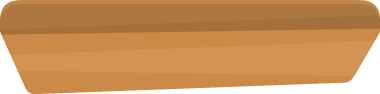

# Platform-remake
La repository contiene una serie di modifiche al gioco JUMPY! pubblicato da kidscancode nella repository [pygame_tutorials](https://github.com/kidscancode/pygame_tutorials). Utilizzando quindi l'ultima versione "[working](https://github.com/kidscancode/pygame_tutorials/tree/master/platform/working)" del gioco platform sono state apportate le seguenti modifiche:

#### Monete
L'aggiunta di monete d'oro, d'argento e di bronzo permette al nostro coniglio di afferlarle durante la partita, esse vengono "salvate" in un nuovo contatore simile al punteggio totale che viene salvato a fine partita nel file "highscore" e visualizzato durante il gioco in alto a destra con la rispettiva icona.

#### Piattaforme
Le piattaforme che inizialmente erano unicamente d'erba, vengono implementate con gli altri tipi contenuti nello spritesheet.
Torta Neve Pietra Legno Sabbia Erba

 

 

 

La scelta di quale piattaforma usare ogni volta che il programma ne genera una è totalmente casuale
```python
# sprites.py
...
class Platform(...):
    ...
    self.type = choice(PLATFORM_TYPES)
    images = self.game.spritesheet.images.platforms[self.type]
    ...
```

PLATFORM_TYPES è una lista dichiarata nei setting che contiene i tipi di piattaforma che ci sono nel gioco; se vorremo aggiungere immagini di nuove piattaforme dobbiamo anche aggiungere il tipo in questa lista per farle comparire.

```python
# setting.py
    ...
    PLATFORM_TYPES = ["grass" ,"cake" ,"sand", "snow", "wood", "stone"]
    ...
```

Ogni piattaforma ha quindi una percentuale di possibilità di generare un powerup, una moneta o una decorazione.
Ovviamente una decorazione può essere generata anche insieme ad una moneta o un powerup; al contrario powerup e monete non possono essere entrambi generati sulla stessa piattaforma: il che spiega `elif` invece di `if` del secondo controllo.

```python
...
class Platform(...):
  ...
  def init(...):
    prob = randrange(100)
    if prob < POW_SPAWN_PCT: Pow(self.game, self)
    elif prob < COIN_SPAWN_PCT: Coin(self.game, self)
    if prob < DECOR_SPAWN_PCT: Decor(self.game, self)
```


#### Decorazioni
Ogni volta che viene generata una piattaforma, c'è una possibilità che venga generato sopra di essa uno sprite di decorazione (per esempio il ciuffo d'erba sopra la piattaforma d'erba, il cactus sopra la piattaforma del deserto...)

        


#### Vite
In alto a sinistra invece, se ottenute, possiamo trovare le icone della "vita". Trovando quindi un powerups di tipo "life" possiamo conservarci una sorta di "ritorno in vita". Alla collisione con un nemico o alla caduta in basso del coniglio, la vita viene sacrificata per permetterci di continuare a salire; il nemico sparirebbe o avremmo una spinta verso l'alto.

#### Morte
Oviamente se non siamo in possesso di item di resurrezione potrebbe capitarci di imbatterci in dei nemici, di conseguenza morendo. La modifica effettuata consiste nel fatto di utilizzare l'animazione "hurt" del coniglio e lasciarlo cadere verso il basso; impedento quindi alla partita di terminare drasticamente all'impatto.


In questo stato il parametro "alive" viene portato a false quindi cadendo non verrà fermato dalle piattaforme
```python
# main.py
class Game:
  ...
  def update(...):
    ...
    if self.player.vel.y > 0 and self.player.alive:
      # controlla collisione in caduta con le piattaforme
      ...
```


#### Sole
In alto a sinistra eccolo li sorridente lo sprite Sun che con la sua semplice animazione se ne sta fermo. Il parametro LAYER è ovviamente il più basso poichè non deve essere stampato sopra nessun altro sprite.


#### Pausa
Premento il tasto P o ESCAPE è ora possibilie mettere in pausa il loop di gioco stampando a monitor una scritta "PAUSE". quando verrà premuto un altro tasto il gioco prosegguira
```python
  # main.py
  ...
  def pause(self):
      self.writer.draw_text(self.screen, "PAUSE", HEIGHT/2)
      self.writer.draw_text(self.screen, "press any key to continue", HEIGHT/4*3)
      pygame.display.flip()
      self.wait_for_key()
  ...

```

La quale funzione viene quindi lanciata quando viene premuto un qualsiasi tasto all'interno della lista degli specificati

```python
# main.py
def events(self):
    for event in pygame.event.get():
        ...
        if event.type == pygame.KEYDOWN:
            if event.key == pygame.K_SPACE: self.player.jump()
            if event.key in [pygame.K_p, pygame.K_ESCAPE]: self.pause()
        ...
```

#### Grandezza finestra
Aggiunta la possibilità di aumentare la altezza della finestra di gioco, ovviamente in maniera automatica. Se quindi il programma riesce ad ottenere la funzione screen_height dal modulo gtk (quindi se è installato)

```python
# setting.py
try:
    from gtk import gdk
    HEIGHT = gdk.screen_height() - 200
except:
    HEIGHT = 800
...
```

A seconda della altezza della finestra dobbiamo quindi decidere quante piattaforme possono esserci al massimo nello stesso momento sullo schermo.

```python
# setting.py
...
TOT_PLATFORMS = int(HEIGHT/100) - 1
...
```

#### Codice
Sia per ragioni di comodita, o di gusti, o di prestazioni sono state apportate le seguenti modifiche ai sorgenti presi dal working:

##### spritesheet.py
La classe Spritesheet che era inizialmente inserita all'interno del modulo sprites.py, è ora spostata in un nuovo modulo spritesheet.py accompagnata da una nuova class Images. In sintesi la seconda classe utilizza la prima per importarsi una ad una le immagini del immagine spritesheet_jumper.png. Cosi facendo, alla generazione di ogni singolo sprite, viene risparmiato il ritaglio dell'immagine poichè è gia stato effettuato al avvio del programma.

```python
class Spritesheet:
    def __init__(self, filename):
    def get_image(self, x, y, width, height, zoom = ZOOM_FACTOR):

class Images:
    def __init__(self,spritesheet):
    def load_images(self):
```

Creiamo quindi un oggetto `Spritesheet` che contiene l'immagine "grande" e la funzione per ritagliarla, creiamo un oggetto di tipo `Images` che conterrà tutte le superfici/immagini ritagliate e ordinate. Quindi gli sprite potranno riferirsi all'immagine che vogliono eseguendo `self.program.images.<[immagine che vgliono]>`

per esempio:
```python
  # PLATFORM
    self.game.spritesheet.images.platforms[self.type]
  # POW
    self.game.spritesheet.images.powerup[self.type]
  # COIN
    self.game.spritesheet.images.coin[self.type]
  # SUN
    self.game.spritesheet.images.sun
  # DECOR
    self.game.spritesheet.images.decors[self.type]
  # PLAYER
    self.game.spritesheet.images.bunny
    self.game.spritesheet.images.female_bunny
```

##### writer.py
Le funzioni per la stesura di testo sulla superfice principale sparpagliate inizialmente per il sorgente vengono tutto spostate in questo nuovo modulo e ottimizzate. Invece di dover riscrivere tutto il testo sulla superfice principale ad ogni inizio e fine partita, vengono definite due superfici che vengono aggiornate solo quando necessario. Inoltre per evitare la schermata nera per una piccola pausa che varia a seconda della potenza della macchina dove eseguiamo il programma, è stata aggiunta una nuova schermate "loading" da visualizzare mentre il gioco si inizializza

```python
# writer.py
class Writer:
    def change_score(self):
    def set_loading_screen(self):
    def set_start_screen(self):
    def set_go_screen(self, highscore, score):
    def draw_text(self, surface, text, y, x=CENTERX):
```

Possiamo quindi vedere che ricreiamo il draw_text, solo che chiederà meno parametri.
Il colore infatti rimane sempre bianco, il fontsize è sempre lo stesso (tranne quando il text che gli diamo è il titolo, loading, o game over). Le coordinate vengono semplificate: la x viene lasciata sempre al centro, unico caso in la funzione viene lanciata modificando il parametro di default è quando stampiamo a monitor i soldi attuali, che andranno a finire in alto a destra. Gli diciamo su quale superfice scrivere poichè se ki facesse sempre su quella principal e dovremmo riscriverla ad ogni frame.

## Strumenti

### spritesheet_test.py
Questo semplice tools utilizza il modulo spritesheet del nostro programma, si legge il file xml che contiene le coordinate di ogni sprite all'interno del immagine e ci permette di scorrerle mostrandoci il nome, le coordinate (se volessimo usarle nel proramma) e naturalmente l'immagine


## Cose da fare
- Aggiungere i suoni alle monete, al powerups della vita
- Permetti al gioco di "diventare notte", sostituire quindi il sole con la luna e mettere uno sfondo più scuro
- Aggiungere uno "shop" per permettere di spendere le monete trovate
- Salvare i migliori 10 punteggi invece che solo l'ultimo
- ...
